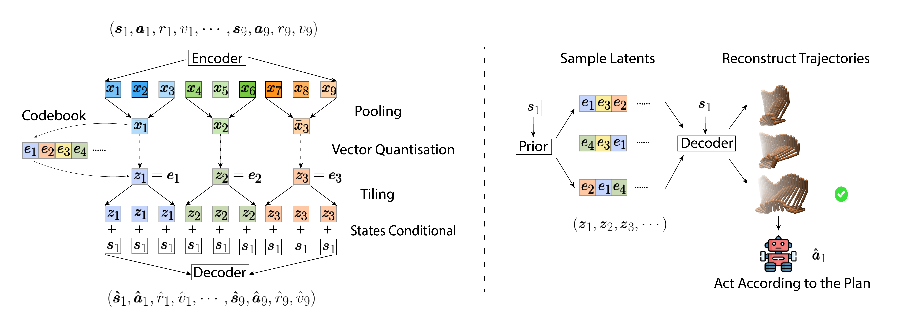

# Trajectory Autoencoding Planner (TAP)

Code release for [Efficient Planning in a Compact Latent Action Space](https://arxiv.org/abs/2208.10291). We recommand to check out the [porject page](https://sites.google.com/view/latentplan) for a quick summary of the method and results.

**Abstract**:
> While planning-based sequence modelling methods have shown great potential in continuous control, scaling them to high-dimensional state-action sequences remains an open challenge due to the high computational complexity and innate difficulty of planning in high-dimensional spaces. We propose the Trajectory Autoencoding Planner (TAP), a planning-based sequence modelling RL method that scales to high state-action dimensionalities. Using a state-conditional Vector-Quantized Variational Autoencoder (VQ-VAE), TAP models the conditional distribution of the trajectories given the current state. When deployed as an RL agent, TAP avoids planning step-by-step in a high-dimensional continuous action space but instead looks for the optimal latent code sequences by beam search. Unlike $O(D^3)$ complexity of Trajectory Transformer, TAP enjoys constant $O(C)$ planning computational complexity regarding state-action dimensionality $D$. Our empirical evaluation also shows the increasingly strong performance of TAP with the growing dimensionality. For Adroit robotic hand manipulation tasks with high state and action dimensionality, TAP surpasses existing model-based methods, including TT, with a large margin and also beats strong model-free actor-critic baselines.



## Installation
All python dependencies are in [`environment.yml`](environment.yml). Install with:

```
conda env create -f environment.yml
conda activate tap
pip install -e .
```

Please note that installing mujoco-py sometimes requires a bit more efforts. See [this](https://github.com/openai/mujoco-py) page for more details.

## Usage
There are three scripts (loco.sh, adroit.sh and antmaze.sh) to run experiments for locomotion control,
antmaze and adroit.
The selected task will be run 5 times with different training seeds and each trained model will then be evaluated with 20 test seeds (20 episodes).

To break it down:
1. train the encoder and decoder:
```
python scripts/train.py --dataset $data --exp_name $name-$round --tag development --seed $round
```
2. train the auto-regressive prior:
```
python scripts/trainprior.py --dataset $data --exp_name $name-$round
```
3. evaluate the trained models:
```
for i in {1..20};
do
   python scripts/plan.py --test_planner beam_prior --dataset $data --exp_name $name-$round --suffix $i --beam_width 64 --n_expand 4 
done 
```
4. report the results:
```
python plotting/read_results.py --exp_name $name --dataset $data
```


## Some Workarounds for Installing mujoco-py or D4RL
### GLIBCXX
GLIBCXX_2.4.29 not being found

Solution:
`ln -s /usr/lib/x86_64-linux-gnu/libstdc++.so.6 libstdc++.so.6`

### GL/glew.h: No such file or directory

conda install -c conda-forge glew
sudo apt-get install libglew-dev

### Installation in ubuntu 22
```
running build_ext
building 'mujoco_py.cymj' extension
...
```

Solution:
`conda install -c conda-forge mesalib`

## Acknowledgements
The organization of this repo is based on [trajectory-transformer](https://github.com/jannerm/trajectory-transformer) repo. Some of the visualization is based on [diffuser](https://github.com/jannerm/diffuser) repo.

## Citation
```
@article{jiang2022latentplan,
    author = {Jiang, Zhengyao and Zhang, Tianjun and Janner, Michael and Li, Yueying and Rocktäschel, Tim and Grefenstette, Edward and Tian, Yuandong},
    title = {Efficient Planning in a Compact Latent Action Space},
    journal={arXiv preprint arXiv:2208.10291},
    year = {2022},
}
```
